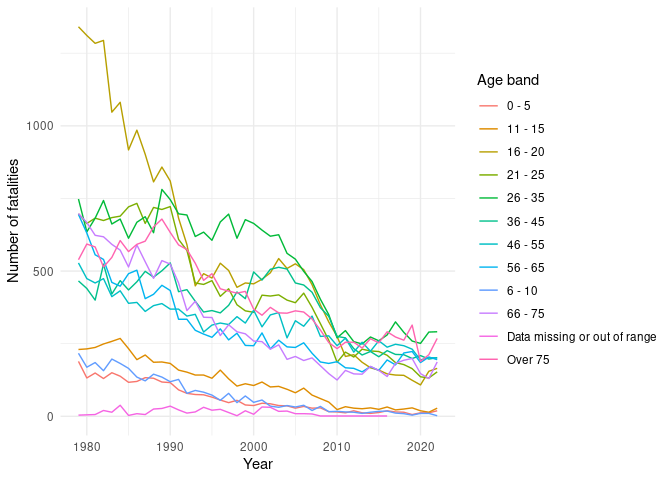
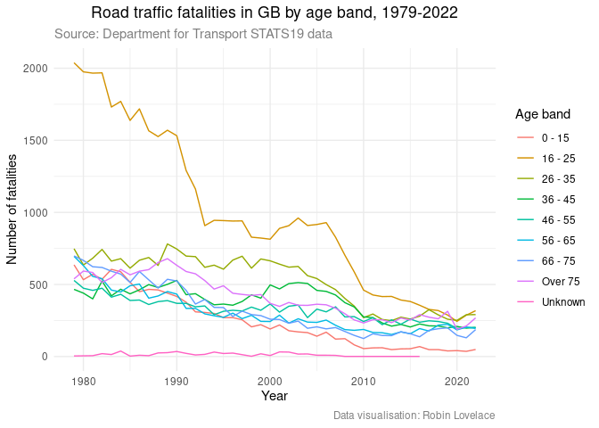
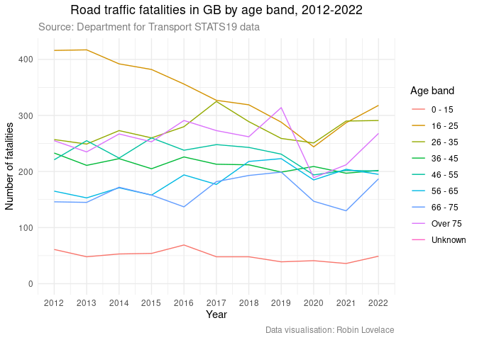
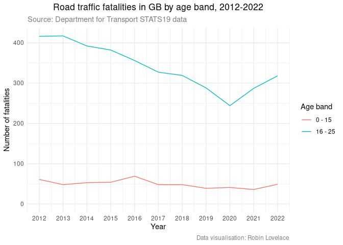

# National road traffic casualty data: exploratory analysis
Robin Lovelace

This quarto document builds on
[previous](https://github.com/Robinlovelace/30mapchallenge2023/blob/main/day1-points.qmd)
work looking at national road traffic casualty data.

``` r
remotes::install_dev("stats19")
remotes::install_dev("gganimate")
```

``` r
library(tidyverse)
```

    ── Attaching core tidyverse packages ──────────────────────── tidyverse 2.0.0 ──
    ✔ dplyr     1.1.4     ✔ readr     2.1.4
    ✔ forcats   1.0.0     ✔ stringr   1.5.1
    ✔ ggplot2   3.4.4     ✔ tibble    3.2.1
    ✔ lubridate 1.9.3     ✔ tidyr     1.3.0
    ✔ purrr     1.0.2     
    ── Conflicts ────────────────────────────────────────── tidyverse_conflicts() ──
    ✖ dplyr::filter() masks stats::filter()
    ✖ dplyr::lag()    masks stats::lag()
    ℹ Use the conflicted package (<http://conflicted.r-lib.org/>) to force all conflicts to become errors

``` r
library(gganimate)
library(arrow)
```

    Some features are not enabled in this build of Arrow. Run `arrow_info()` for more information.

    Attaching package: 'arrow'

    The following object is masked from 'package:lubridate':

        duration

    The following object is masked from 'package:utils':

        timestamp

``` r
library(stats19)
```

    Data provided under OGL v3.0. Cite the source and link to:
    www.nationalarchives.gov.uk/doc/open-government-licence/version/3/

``` r
collisions = get_stats19(year = 1979, type = "collision")
casualties = get_stats19(year = 1979, type = "cas")
# Show number of collisions recorded each year:
names(collisions)
names(casualties)
```

Let’s focus on the casualties data first, and pull out all fatalities,
and all fatalities by age band:

``` r
fatalities = casualties |>
  filter(casualty_severity == "Fatal")
saveRDS(fatalities, "fatalities.Rds")
table(fatalities$age_of_casualty)
table(fatalities$age_band_of_casualty)
#   0 - 5                      11 - 15 
#                         2716                         5112 
#                      16 - 20                      21 - 25 
#                        24110                        18746 
#                      26 - 35                      36 - 45 
#                        23137                        16601 
#                      46 - 55                      56 - 65 
#                        14243                        13384 
#                       6 - 10                      66 - 75 
#                         3128                        14197 
# Data missing or out of range                      Over 75 
#                          470                        18199 
```

``` r
fatalities = readRDS("fatalities.Rds")
```

``` r
fatalities_by_age = fatalities |>
  group_by(accident_year, age_band_of_casualty) |>
  summarise(n = n()) |>
  arrange(desc(n))
```

    `summarise()` has grouped output by 'accident_year'. You can override using the
    `.groups` argument.

``` r
# Plot the results over time as line graph:
fatalities_by_age |>
  ggplot(aes(accident_year, n, group = age_band_of_casualty)) +
  geom_line(aes(colour = age_band_of_casualty)) +
  theme_minimal() +
  labs(x = "Year", y = "Number of fatalities", colour = "Age band")
```



``` r
fatalities = fatalities |>
  mutate(age_band = case_when(
    age_band_of_casualty == "0 - 5" ~ "0 - 15",
    age_band_of_casualty == "6 - 10" ~ "0 - 15",
    age_band_of_casualty == "11 - 15" ~ "0 - 15",
    age_band_of_casualty == "16 - 20" ~ "16 - 25",
    age_band_of_casualty == "21 - 25" ~ "16 - 25",
    age_band_of_casualty == "26 - 35" ~ "26 - 35",
    age_band_of_casualty == "36 - 45" ~ "36 - 45",
    age_band_of_casualty == "46 - 55" ~ "46 - 55",
    age_band_of_casualty == "56 - 65" ~ "56 - 65",
    age_band_of_casualty == "66 - 75" ~ "66 - 75",
    age_band_of_casualty == "Over 75" ~ "Over 75",
    TRUE ~ "Unknown"
  ))
# table(fatalities$age_band)
```

``` r
# Plot the results over time as line graph:
fatalities_by_age = fatalities |>
  group_by(accident_year, age_band) |>
  summarise(n = n()) |>
  arrange(desc(n))
```

    `summarise()` has grouped output by 'accident_year'. You can override using the
    `.groups` argument.

``` r
fatalities_by_age |>
  ggplot(aes(accident_year, n, group = age_band)) +
  geom_line(aes(colour = age_band)) +
  theme_minimal() +
  labs(x = "Year", y = "Number of fatalities", colour = "Age band")
```



``` r
# Re-generate the same results for last 10 years to 2022
fatalities_by_age = fatalities |>
  filter(accident_year >= 2012) |>
  group_by(accident_year, age_band) |>
  summarise(n = n()) |>
  arrange(desc(n))
```

    `summarise()` has grouped output by 'accident_year'. You can override using the
    `.groups` argument.

``` r
fatalities_by_age |>
  ggplot(aes(accident_year, n, group = age_band)) +
  geom_line(aes(colour = age_band)) +
  theme_minimal() +
  labs(x = "Year", y = "Number of fatalities", colour = "Age band") +
  scale_x_continuous(breaks = seq(2012, 2022, 1))
```



``` r
# Same with just 0-15 year olds:
fatalities_by_age = fatalities |>
  filter(accident_year >= 2012) |>
  filter(age_band == "0 - 15") |>
  group_by(accident_year, age_band) |>
  summarise(n = n()) |>
  arrange(desc(n))
```

    `summarise()` has grouped output by 'accident_year'. You can override using the
    `.groups` argument.

``` r
fatalities_by_age |>
  ggplot(aes(accident_year, n, group = age_band)) +
  geom_line(aes(colour = age_band)) +
  theme_minimal() +
  labs(x = "Year", y = "Number of fatalities", colour = "Age band") +
  scale_x_continuous(breaks = seq(2012, 2022, 1))
```



The same information as a table:

``` r
fatalities_by_age |>
  pivot_wider(names_from = age_band, values_from = n) |>
  arrange(desc(accident_year)) |>
  knitr::kable()
```

| accident_year | 0 - 15 |
|--------------:|-------:|
|          2022 |     49 |
|          2021 |     36 |
|          2020 |     41 |
|          2019 |     39 |
|          2018 |     48 |
|          2017 |     48 |
|          2016 |     69 |
|          2015 |     54 |
|          2014 |     53 |
|          2013 |     48 |
|          2012 |     61 |

Next, we’ll join the collisions dataset with the casualties, so we can
find out where casualties happened etc.
