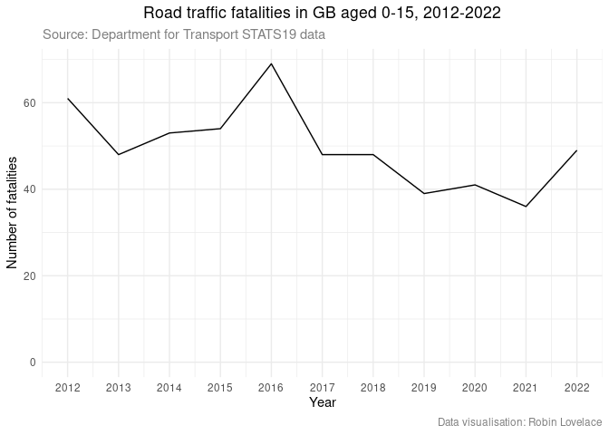
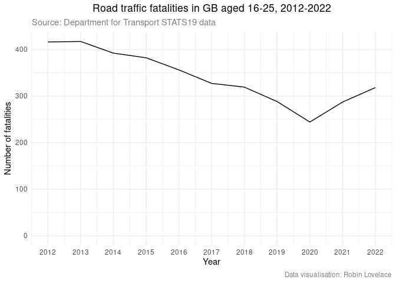

# National road traffic casualty data: exploratory analysis
Robin Lovelace

This quarto document builds on
[previous](https://github.com/Robinlovelace/30mapchallenge2023/blob/main/day1-points.qmd)
work looking at national road traffic casualty data.

Let’s focus on the casualties data first, and pull out all fatalities,
and all fatalities by age band:

The same information as a table:

| accident_year | 0 - 15 | 16 - 25 |
|--------------:|-------:|--------:|
|          2022 |     49 |     318 |
|          2021 |     36 |     287 |
|          2020 |     41 |     244 |
|          2019 |     39 |     288 |
|          2018 |     48 |     319 |
|          2017 |     48 |     327 |
|          2016 |     69 |     356 |
|          2015 |     54 |     382 |
|          2014 |     53 |     392 |
|          2013 |     48 |     417 |
|          2012 |     61 |     416 |

Next, we’ll join the collisions dataset with the casualties, so we can
find out where casualties happened etc.
